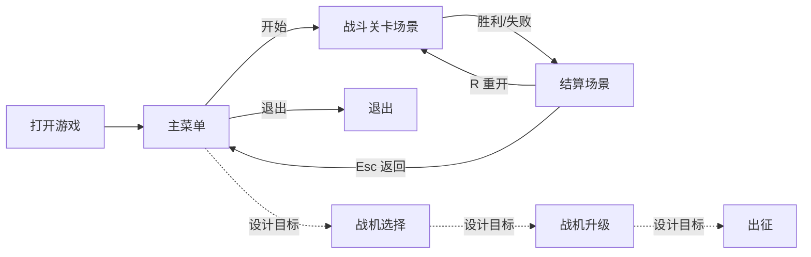

# 游戏设计文档 (Game Design Document)

## 1. 游戏概述

### 1.1 游戏名称
- **中文名称**: 星际试炼（暂定）
- **英文名称**: Star Trial (Working Title)

### 1.2 游戏类型
- **主要类型**: 纵版太空射击 / 动作
- **次要类型**: Roguelite、生存、弹幕元素

### 1.3 目标平台
- **主要平台**: PC (Windows, macOS, Linux)
- **开发引擎**: Ebitengine v2.8.8（Go 1.24.7）

### 1.4 目标受众
- **年龄范围**: 12+
- **技能水平**: 休闲到中度硬核
- **游戏经验**: 新手友好，高手可追求极限与构筑深度

## 2. 游戏概念

### 2.1 核心玩法
操纵宇宙飞船射击太空敌人

### 2.2 游戏目标
在越来越多的敌人当中，尽可能存活的久一些

### 2.3 独特卖点
每击杀一定数量敌人，可以获得一个技能，技能与技能之间会相互影响，最终呈现出充满创造性的技能形态

## 3. 游戏世界

### 3.1 世界观
人类发展到了外太空，进入了宇宙高等文明行列，文明与文明之间时常发生战争与摩擦，为了保卫人类文明疆域，需要真正的强者来守护。

### 3.2 视觉风格
- **艺术风格**: 像素艺术
- **色彩方案**: 深空背景（#0A1024 / #1E163F），霓虹强调色（青 #00E5FF、品红 #FF2EC4、黄 #FFD300），危险提示红（#FF3B30），爆炸高光橙（#FF8C00）
- **分辨率**: 逻辑分辨率 800×600，等比缩放适配窗口/全屏（保持纵横比，必要时 letterbox）

### 3.3 音效设计
- **背景音乐**: 合成波/太空氛围（循环无缝），战斗阶段节奏更强
- **音效**: 激光/爆炸/拾取/UI 切换等短音效；建议采样率 44.1kHz，BGM 使用 .ogg，SFX 使用 .wav；混音预留 6dB Headroom（BGM 音量约为 SFX 的 70%）

## 4. 游戏机制

### 4.1 核心系统
#### 战机系统

出征前需要选择一艘战机，每艘战机有不同属性值，

战机属性：
  - 生命
  - 速度
  - 体型
  - 1个被动技能

数值与实现映射：
- 生命（lives）：初始 3（被动/天赋可提高）。
- 速度（Speed）：默认 5.0（像素/帧），范围建议 2.0 ~ 10.0。
- 体型（Width×Height）：默认 40×30（像素），体型变更按等比缩放，碰撞盒跟随。
- 出生点：逻辑坐标 (400, 500) 基于 800×600。

#### 技能系统

##### 主动射击技能（FireSkillConfig）

子弹属性：
  - FireRateHz: 每秒发射次数，范围 0.5 ~ 30.0，影响射击冷却
  - BulletsPerShot: 每次发射数量，范围 1 ~ 20
  - SpreadDeg: 子弹发射时的散射总角度（度），范围 0 ~ 180
  - BulletSpeed: 子弹飞行速度，范围 1 ~ 30
  - BurstChance: 概率连发（0~1），当触发连发时，按连发间隔追加一次射击
  - PenetrationCount: 子弹穿透次数，范围 0 ~ 10
  - EnableHoming: 是否开启追踪
  - HomingTurnRateRad: 追踪转向速率（弧度/帧），范围 0.0 ~ 1.0（设计默认 0.01，当前实现 0.08）
  - BurstInterval: 连发间隔（毫秒），默认 60ms，建议范围 30ms ~ 300ms

默认值（开发环境当前实现）：
- FireRateHz 5.0、BulletsPerShot 1、SpreadDeg 2°、BulletSpeed 8.0、BurstChance 0、PenetrationCount 0、EnableHoming=false、HomingTurnRateRad 0.08、BurstInterval 60ms。

- 设计默认与实现差异：HomingTurnRateRad 设计 0.01，当前实现 0.08（将随手感调优）。

冷却计算：
- 射击冷却 shotDelay = 1 / FireRateHz（秒）；当 FireRateHz ≤ 0 时使用兜底 300ms。

设计约束：
- 追踪弹仅对场上活跃敌机寻的；若无目标则按当前方向直行。
- 数值调整统一使用“裁剪到范围”策略，所有输入在 UI/调试均会被钳制到上述区间。

##### 被动技能

每艘战机有自己独特被动技能，
被动技能：
  - 生命值+1
  - 速度+50%
  - 体型-50%

叠加与上限：
- 同名被动不可重复；不同被动可叠加，叠加后再与全局上限裁剪（如速度上限 10.0、体型下限 50%）。

#### 天赋系统

每一艘战机都有自己的独特天赋系统，将出征返航带回来的功勋投入天赋系统，可以解锁天赋，天赋包含当前战机的属性与技能属性加成。

结构与规则：
- 形态：树形；节点有前置依赖与最大等级。
- 货币：功勋（当前实现计分 score 暂代，1 分=1 功勋，设计目标）。
- 成本：基础 1、2、3… 随层级增长；高阶节点消耗更高。
- 典型节点：
  - +1 生命（可叠加，至多 +3）
  - 速度 +10%/级（上限总计 +50%）
  - FireRateHz +0.5/级（上限 30Hz）
  - BulletsPerShot +1/级（上限 20）
  - SpreadDeg +5°/级（0~180°）或专精节点（降低散射）
  - BulletSpeed +0.5/级（上限 30）
  - PenetrationCount +1/级（上限 10）
  - 启用追踪与提升 HomingTurnRateRad（至多 1.0）

实现准则：
- 所有加成在进入战局时汇总应用；战局中获得的技能即时生效。
- 最终属性经由范围裁剪，保证与实现一致并避免数值溢出。

### 4.2 控制方式
- **全局**:
  - L：切换语言（中文 → 英文 → 俄文）
  - Esc：返回/暂停（设计目标，待实现）

- **主菜单**:
  - 上/下：切换选项
  - Enter / Space：确认
  - Esc：返回上一级（设计目标，待实现）

- **战斗**:
  - 上/下/左/右：移动
  - Space：射击（受射速/冷却限制）
  - G：打开/关闭调试面板（仅开发用）
  - Tab：调试面板内切换页签（仅开发用）
  - 左/右：调试面板内调整数值（仅开发用）
  - R：重新开始（仅在结算界面 Game Over / Victory）

- **鼠标控制**: 无（暂不支持）

### 4.3 游戏场景

#### 主菜单（当前实现）

- 选项：开始游戏、退出。
- 操作：上/下切换；Enter/Space 确认；L 切换语言（zh → en → ru）。
- 文案：引用 `menu.*` 键；底部显示 `menu.instructions` 与 `menu.esc_hint`。
- 流转：
  - 开始游戏 → 进入“战斗关卡场景”。
  - 退出 → 进程退出。

#### 战机选择（设计目标）

- 目的：在开局前选择战机与被动，查看核心属性（生命、速度、体型、被动）。
- 操作：左右切换战机；Enter 确认；Esc 返回主菜单；Tab 查看被动/简介。
- UI：
  - 左：战机预览与体型；右：属性面板与被动说明。
  - 底部：提示当前可用功勋与进入“战机升级”。
- 流转：确认 → 进入“战机升级场景”；Esc → 主菜单。

#### 战机升级场景（设计目标）

右上角显示当前拥有的功勋，界面中间显示天赋加点情况，天赋为树形，每个节点点亮后可以获得其中的属性加成，加点的条件为前置节点点亮和花费功勋

- 操作：
  - 上/下/左/右在节点间移动；Enter 确认加点；Backspace/Del 撤销最近一步（若支持）。
  - Esc 返回战机选择。
- UI：
  - 中央：天赋树；右：节点说明、加成预览、下一级消耗；上：功勋余额。
- 数据：加点结果持久化为账号/本地存档，跨局保留。

#### 出征场景（设计目标）

- 目的：设定本局难度与可选修正（如 60s 固定时长下的难度倍率）。
- 选项：难度（轻松/标准/困难）、挑战修正（如同屏上限±、生成间隔±）。
- 结算：根据难度倍率对功勋结算施加 multiplier（如 0.8/1.0/1.3）。
- 流转：确认 → 进入“战斗关卡场景”；Esc → 战机选择。

#### 战斗关卡场景

在出征场景确认进入关卡后，进入战斗关卡场景，通过上下左右键控制战机移动，空格键发射。小怪按“时间制波次”生成（详见第5章），随后进入 Boss 阶段。击败敌机/Boss 可获得积分，结算为功勋。

- HUD：左上显示分数与生命；左侧显示射击参数；右上/顶部显示剩余时间/当前波。
- 开发调试：G 开关 GM 面板；Tab 切换页签；左右调整参数（仅开发用）。
- 终局：
  - Game Over：生命耗尽；显示 `common.game_over`、`common.restart`、`common.back_menu`。
  - Victory：Boss 被击败（或 60s 收束）；显示 `common.victory`、`common.restart`、`common.back_menu`。

#### 结算场景（当前实现为叠加在战斗中的结算层）

- 条件：胜利或失败时进入。
- 展示：结果标题、得分、提示 R 重开、ESC 返回菜单；后续可扩展显示击杀数、用时、评级、所得功勋等。
- 操作：
  - R：立即重新开始同一模式。
  - ESC：返回主菜单。

##### HUD 与计时
- 左上显示：分数（Score）、生命（Lives）。
- 左侧信息栏显示：射击参数（FireRateHz、BulletsPerShot、SpreadDeg、BulletSpeed、Penetration、Homing、TurnRate、Burst 及 Interval）。
- 顶部或右上显示：战斗剩余时间或当前波次剩余时间（60s 时间制）。
- 结算界面：显示胜利/失败提示、R 键重开与 ESC 返回主菜单提示。

## 5. 战斗关卡设计

### 5.1 关卡结构（60s 时间制波次）

- 战斗总时长目标：60 秒（±5s）。
- 小怪阶段时长预算：45 秒；Boss 阶段时长预算：15 秒。
- 波次数量：5 波，每波 9 秒，波间过渡 ~0 秒（连续衔接）。
- 时间制推进：到达该波 9 秒即进入下一波，不再依赖清场。

生成与强度：
- 生成方式：按时间窗口持续生成；每波设置独立的最小生成间隔与批量上限。
- 每波最小生成间隔（ms）：[600, 500, 400, 320, 250]（线性或按曲线插值均可）。
- 每批数量：2（可随难度动态增至 3）。
- 同屏上限：12（防止拥塞，保证帧率）。
- 敌机生命进阶：HP = 1 + floor(waveIndex/2)，上限 5（第1/2波=1，第3/4波=2，第5波=3）。

期望效果：
- 第1波（9s）：引导强度，间隔600ms，约每秒 ~3-4 个单位的出现尝试（受上限与清理速度影响）。
- 第5波（9s）：高强度压制，间隔250ms，持续高压但受同屏上限控制。

实现差异与改造建议：
- 现实现为“计数制波次（清场推进）”，需改为“时间制波次（定时推进）”。
- 需要引入 per-wave 定时器与“生成窗口”逻辑；Boss 出场不再依赖清场。
- 同屏上限建议从 20 调整为 12；批量从 3 调整为 2（后期可自适应）。

#### 敌机（当前实现）

- 体积：30×25；初始位置：Y = -30，X ∈ [0, 760] 随机。
- 速度：VY ∈ [2, 3]，VX ∈ {-1, 0, 1} 随机。
- 出界移除：Y > 600 失活。
- 受击：每次被命中 -1 生命；被击毁加分 +10，并在命中位置产生爆炸效果。
- 与玩家碰撞：玩家生命 -1；若仍存活则重置至 (400, 500) 并触发爆炸特效。

（设计目标，待实现的敌机类型）
- 远程型：会定时朝玩家射击。
- 之字型：横向摆动前进，回避率高。
- 肉盾型：高生命、低速度。
- 自爆型：接近玩家后加速撞击并造成高伤害。

### 5.2 Boss 目标与参数（15s 收尾）

- 触发条件：小怪阶段 45 秒结束后，直接生成 Boss（不等待清场）。
- 体积：100×60；初始位置 (350, 60)。
- 移动：在 X ∈ [50, 750-Width]、Y ∈ [20, 300-Height] 范围内弹跳移动（边界反弹）。
- 生命：60（被子弹命中每次 -1）。
- 时间预算：15 秒；为确保总时长 60 秒，可引入以下收束机制：
  - 软收束：第 10 秒起 Boss 逐步“暴走”，降低技能冷却或暴露弱点，提升玩家输出窗口。
  - 硬收束：第 15 秒未击杀则触发处决演出/结算（保留胜利或按剩余血量判定评级）。
- 胜利条件：Boss 生命降至 0；或到达时间上限进入强制结算。

### 5.3 关卡目标
击败 Boss 则完成关卡目标。后续可扩展为多关卡连续挑战与分层奖励（设计目标）。

## 6. 经济与成长（Score → 功勋）

- 计分与掉落：
  - 小敌机：+10 分（与当前实现一致）。
  - Boss：+200 分（建议值，用于区分阶段奖励）。
  - 后续可加入连击与无伤加成（设计目标）。
- 结算与货币：
  - 本局总分按 1:1 结算为“功勋”，进入“战机升级/天赋”界面用于解锁与强化。
  - 可加入难度系数 multiplier（0.8 ~ 2.0）影响最终功勋。
- 成长与成本（与第4章天赋系统对齐）：
  - 线性/阶梯成本：同一路线节点成本随层级增加（如 1/2/3/5/8…）。
  - 强度约束：最终属性应用全局上下限（速度 ≤ 10.0、FireRateHz ≤ 30Hz、Penetration ≤ 10 等）。
- 评分与结局（设计目标）：
  - 依据用时、剩余生命、Boss 余血等计算评级（S/A/B/C）。
  - 评级影响额外功勋或外观解锁几率。

## 7. 声音与本地化

### 7.1 声音
- 音频引擎：Ebitengine 音频上下文；当前 SFX 使用合成方式实时生成，采样率 22050Hz。
- SFX（射击/命中）可调参数：DurationSec、BaseFreq、MinFreq、SweepFactor、Decay、Amplitude、Waveform(square/triangle/noise)。
- 混音建议：
  - SFX 峰值预留：-6dB；BGM 电平约为 SFX 的 70%。
  - 同时播放的 SFX 数量做上限（例如 16），避免削波。
- 资源格式：
  - BGM：.ogg（44.1kHz 或 48kHz），循环无缝；
  - SFX：可继续使用实时合成，或改为短 .wav 采样。
- 开发辅助：GM 面板提供射击音效参数调节并实时试听（已实现）。

### 7.2 本地化
- 语言：中文（zh）、英文（en）、俄文（ru）；运行中按 L 键循环切换。
- 文本加载：优先读取 `assets/i18n/*.json`，缺失时回退内置字典；缺词回显 key。
- 关键键值规范：
  - 通用：`common.score`、`common.lives`、`common.game_over`、`common.restart`、`common.back_menu`、`common.controls`、`common.on`、`common.off`、`common.victory`。
  - 菜单：`menu.title`、`menu.start`、`menu.exit`、`menu.instructions`、`menu.esc_hint`。
  - 射击参数：`shooter.fire.rate`、`shooter.fire.per_shot`、`shooter.fire.spread`、`shooter.fire.speed`、`shooter.fire.penetration`、`shooter.fire.homing`、`shooter.fire.turn_rate`、`shooter.fire.burst`。
- 资源组织：
  - 目录：`assets/i18n/zh.json`、`en.json`、`ru.json`。
  - 约定：新增 UI/HUD 文案需同步三语；提交前至少保证中文与英文可用。
