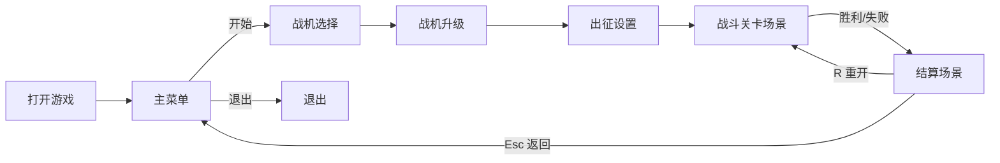

# 游戏设计文档 (Game Design Document)

## 1. 游戏概述

### 1.1 游戏名称
- **中文名称**: 星际试炼（暂定）
- **英文名称**: Star Trial (Working Title)

### 1.2 游戏类型
- **主要类型**: 纵版太空射击 / 动作
- **次要类型**: Roguelite、生存、弹幕元素

### 1.3 目标平台
- **主要平台**: PC (Windows, macOS, Linux)
- **开发引擎**: Ebitengine v2.8.8（Go 1.24.7）
- **架构模式**: ECS (Entity Component System) - 使用 donburi v1.4.4

### 1.4 目标受众
- **年龄范围**: 12+
- **技能水平**: 休闲到中度硬核
- **游戏经验**: 新手友好，高手可追求极限与构筑深度

## 2. 游戏概念

### 2.1 核心玩法
操纵宇宙飞船射击太空敌人

### 2.2 游戏目标
在越来越多的敌人当中，尽可能存活的久一些

### 2.3 独特卖点
每击杀一定数量敌人，可以获得一个技能，技能与技能之间会相互影响，最终呈现出充满创造性的技能形态

## 3. 游戏世界

### 3.1 世界观
人类发展到了外太空，进入了宇宙高等文明行列，文明与文明之间时常发生战争与摩擦，为了保卫人类文明疆域，需要真正的强者来守护。

### 3.2 视觉风格
- **艺术风格**: 像素艺术
- **色彩方案**: 深空背景（#0A1024 / #1E163F），霓虹强调色（青 #00E5FF、品红 #FF2EC4、黄 #FFD300），危险提示红（#FF3B30），爆炸高光橙（#FF8C00）
- **分辨率**: 逻辑分辨率 800×600，等比缩放适配窗口/全屏（保持纵横比，必要时 letterbox）

### 3.3 音效设计
- **背景音乐**: 合成波/太空氛围（循环无缝），战斗阶段节奏更强
- **音效**: 激光/爆炸/拾取/UI 切换等短音效；建议采样率 44.1kHz，BGM 使用 .ogg，SFX 使用 .wav；混音预留 6dB Headroom（BGM 音量约为 SFX 的 70%）

## 4. 游戏机制

### 4.1 核心系统
#### 战机系统

出征前需要选择一艘战机，每艘战机有不同属性值，

战机属性：
  - 生命
  - 速度
  - 体型
  - 1个被动技能

数值与实现映射：
- 生命（lives）：初始 3（被动/天赋可提高）。
- 速度（Speed）：默认 5.0（像素/帧），范围建议 2.0 ~ 10.0。
- 体型（Width×Height）：默认 40×30（像素），体型变更按等比缩放，碰撞盒跟随。
- 出生点：逻辑坐标 (400, 500) 基于 800×600。

#### 技能系统

##### 主动射击技能（FireSkillConfig）

子弹属性：
  - FireRateHz: 每秒发射次数，范围 0.5 ~ 30.0，影响射击冷却
  - BulletsPerShot: 每次发射数量，范围 1 ~ 20
  - SpreadDeg: 子弹发射时的散射总角度（度），范围 0 ~ 180
  - BulletSpeed: 子弹飞行速度，范围 1 ~ 30
  - BurstChance: 概率连发（0~1），当触发连发时，按连发间隔追加一次射击
  - PenetrationCount: 子弹穿透次数，范围 0 ~ 10
  - EnableHoming: 是否开启追踪
  - HomingTurnRateRad: 追踪转向速率（弧度/帧），范围 0.0 ~ 1.0（设计默认 0.01，当前实现 0.08）
  - BurstInterval: 连发间隔（毫秒），默认 60ms，建议范围 30ms ~ 300ms

默认值（开发环境当前实现）：
- FireRateHz 5.0、BulletsPerShot 1、SpreadDeg 2°、BulletSpeed 8.0、BurstChance 0、PenetrationCount 0、EnableHoming=false、HomingTurnRateRad 0.08、BurstInterval 60ms。

- 设计默认与实现差异：HomingTurnRateRad 设计 0.01，当前实现 0.08（将随手感调优）。

冷却计算：
- 射击冷却 shotDelay = 1 / FireRateHz（秒）；当 FireRateHz ≤ 0 时使用兜底 300ms。

设计约束：
- 追踪弹仅对场上活跃敌机寻的；若无目标则按当前方向直行。
- 数值调整统一使用“裁剪到范围”策略，所有输入在 UI/调试均会被钳制到上述区间。

##### 被动技能（当前实现）

每艘战机都有独特的被动技能，为战斗提供不同的策略选择：

**Alpha 战机 - 战场收割（Harvest）**
- 效果：每击杀 5 个敌机回复 1 点生命值
- 限制：生命值不超过最大生命值上限
- 战术定位：持续作战能力强，适合稳健推进
- 触发提示：击杀计数显示 "Kills: X/5"

**Beta 战机 - 速度狂热（Speed Frenzy）**
- 效果：连续击杀敌机叠加射速 buff，每层 +5% 射速
- 层数上限：最多 5 层（+25% 射速）
- 持续时间：3 秒未击杀敌机则清空所有层数
- 战术定位：高风险高回报，鼓励激进打法
- 触发提示：狂热层数显示 "Frenzy: X"

**Gamma 战机 - 闪避大师（Dodge Master）**
- 效果：受到伤害后获得 2 秒无敌时间
- 冷却时间：10 秒
- 战术定位：容错率高，适合新手和高难度挑战
- 触发提示：无敌期间边框闪烁，冷却中显示剩余时间

**Delta 战机 - 能量护盾（Energy Shield）**
- 效果：额外护盾值等于最大生命值
- 护盾机制：护盾先于生命值承受伤害
- 自动回复：5 秒不受伤害后护盾开始自动回复
- 战术定位：生存能力强，适合持久战
- 触发提示：护盾条显示在生命条上方

叠加与上限：
- 同名被动不可重复；不同被动可叠加，叠加后再与全局上限裁剪（如速度上限 10.0、体型下限 50%）。

#### 升级系统（当前实现）

**实现方式**：每次出征前在升级场景使用功勋进行属性加点。

**升级选项**（8 项）：
1. **射速** (ModFireRateHz)
   - 增量：+0.5/级
   - 基础成本：10 功勋
   - 上限：30.0 Hz
   
2. **子弹数** (ModBulletsPerShot)
   - 增量：+1/级
   - 基础成本：20 功勋
   - 上限：20 发

3. **穿透** (ModPenetration)
   - 增量：+1/级
   - 基础成本：15 功勋
   - 上限：10 次

4. **散射收窄** (ModSpreadDeltaDeg)
   - 增量：+5°/级
   - 基础成本：12 功勋
   - 上限：180°

5. **子弹速度** (ModBulletSpeed)
   - 增量：+0.5/级
   - 基础成本：8 功勋
   - 上限：30.0

6. **连发概率** (ModBurstChance)
   - 增量：+0.05/级
   - 基础成本：25 功勋
   - 上限：1.0 (100%)

7. **启用追踪** (ModEnableHoming)
   - 类型：布尔开关
   - 基础成本：50 功勋
   - 效果：开启后子弹自动追踪敌机

8. **转向速度** (ModTurnRateRad)
   - 增量：+0.02 弧度/级
   - 基础成本：30 功勋
   - 上限：1.0 弧度

**成本计算规则**：
```
成本 = 基础成本 × 2^当前等级
```
- 示例：射速第 1 级 = 10 功勋，第 2 级 = 20，第 3 级 = 40，第 4 级 = 80
- 成本指数增长，防止无限加点

**洗点机制**：
- 支持使用左方向键减点
- 退款金额 = 上一级成本
- 可随时调整加点方案

**数据持久化**：
- 升级数据保存到 SQLite 数据库
- 下次进入升级场景自动恢复上次加点
- 跨局保留加点配置

**操作说明**：
- ↑↓：选择升级项
- ←→：减点/加点
- Enter：确认并进入下一场景

实现准则：
- 所有加成在进入战局时汇总应用；战局中即时生效。
- 最终属性经由范围裁剪，保证与实现一致并避免数值溢出。
- 所有升级项都有明确的上限值，防止数值溢出。

### 4.2 控制方式
- **全局**:
  - L：切换语言（中文 → 英文 → 俄文）
  - Esc：返回/暂停（设计目标，待实现）

- **主菜单**:
  - 上/下：切换选项
  - Enter / Space：确认
  - Esc：返回上一级（设计目标，待实现）

- **战斗**:
  - 上/下/左/右：移动
  - Space：射击（受射速/冷却限制）
  - G：打开/关闭调试面板（仅开发用）
  - Tab：调试面板内切换页签（仅开发用）
  - 左/右：调试面板内调整数值（仅开发用）
  - R：重新开始（仅在结算界面 Game Over / Victory）

- **鼠标控制**: 无（暂不支持）


### 4.3 游戏场景

**当前实现流程**：

#### 主菜单（当前实现）

- 选项：开始游戏、退出。
- 操作：上/下切换；Enter/Space 确认；L 切换语言（zh → en → ru）。
- 文案：引用 `menu.*` 键；底部显示 `menu.instructions` 与 `menu.esc_hint`。
- 流转：
  - 开始游戏 → 进入“战斗关卡场景”。
  - 退出 → 进程退出。

#### 战机选择场景（当前实现）

**目的**：选择战机类型，不同战机有不同的基础属性。

**实现内容**：
- 战机类型：3 种可选（标准型、高速型、坦克型）
- 操作：左右切换战机；Enter 确认；L 切换语言
- UI：
  - 中央：战机名称与编号
  - 底部：切换提示与确认提示
- 流转：确认 → 进入"战机升级场景"

**战机类型**（当前简化实现）：
1. **标准型** (Ship-01)
   - 平衡型配置
   
2. **高速型** (Ship-02)  
   - 速度优势
   
3. **坦克型** (Ship-03)
   - 生命值优势

#### 战机升级场景（当前实现）

**目的**：使用功勋对战机射击属性进行加点强化。

**实现内容**：
- 右上角显示当前功勋余额
- 中央显示 8 个升级选项及其当前值和升级成本
- 支持加点和洗点操作

**操作**：
- ↑↓：选择升级项
- ←→：减点/加点（实时消耗/退还功勋）
- Enter：确认并进入下一场景
- L：切换语言

**UI 布局**：
- 顶部：标题 + 功勋余额
- 中部：8 个升级项列表
  - 每项显示：名称 + 当前值 + 成本
  - 当前选中项高亮显示
- 底部：操作提示

**数据持久化**：
- 升级数据保存到 SQLite (`game_progress.db`)
- 自动恢复上次加点配置
- 跨局保留

#### 出征场景（当前实现）

**目的**：设定本局难度倍率，难度越高获得的功勋越多。

**实现内容**：
- **难度范围**：0.5 ~ 999999999.0（连续可调）
- **动态步进**：根据当前难度自动调整步进大小
  - 难度 < 2：步进 0.1
  - 难度 < 10：步进 0.5
  - 难度 < 100：步进 1
  - 难度 < 1000：步进 10
  - 以此类推（指数增长）
- **长按加速**：持续按住方向键 0.5 秒后进入快速调整模式
- **成本机制**：通过 `balance.DifficultyCost()` 计算所需功勋
- **功勋消耗**：确认出征时扣除对应功勋

**操作**：
- ←→：减少/增加难度（支持长按加速）
- Enter：消耗功勋确认出征
- L：切换语言

**UI 布局**：
- 顶部：标题
- 上部：当前功勋余额（金色）
- 中部：当前难度倍率 + 所需成本（大字号）
- 底部：操作提示

**结算**：
- 根据难度倍率影响战斗中的敌机强度
- 击败敌机获得的功勋按倍率计算
- 难度越高，奖励越多

**流转**：
- 确认 → 进入"战斗关卡场景"
- 功勋不足 → 无法确认（提示音效）

#### 战斗关卡场景

在出征场景确认进入关卡后，进入战斗关卡场景，通过上下左右键控制战机移动，空格键发射。小怪按“时间制波次”生成（详见第5章），随后进入 Boss 阶段。击败敌机/Boss 可获得积分，结算为功勋。

- HUD：左上显示分数与生命；左侧显示射击参数；右上/顶部显示剩余时间/当前波。
- 开发调试：G 开关 GM 面板；Tab 切换页签；左右调整参数（仅开发用）。
- 终局：
  - Game Over：生命耗尽；显示 `common.game_over`、`common.restart`、`common.back_menu`。
  - Victory：Boss 被击败（或 60s 收束）；显示 `common.victory`、`common.restart`、`common.back_menu`。

#### 结算场景（当前实现为叠加在战斗中的结算层）

- 条件：胜利或失败时进入。
- 展示：结果标题、得分、提示 R 重开、ESC 返回菜单；后续可扩展显示击杀数、用时、评级、所得功勋等。
- 操作：
  - R：立即重新开始同一模式。
  - ESC：返回主菜单。

##### HUD 与计时
- 左上显示：分数（Score）、生命（Lives）。
- 左侧信息栏显示：射击参数（FireRateHz、BulletsPerShot、SpreadDeg、BulletSpeed、Penetration、Homing、TurnRate、Burst 及 Interval）。
- 顶部或右上显示：战斗剩余时间或当前波次剩余时间（60s 时间制）。
- 结算界面：显示胜利/失败提示、R 键重开与 ESC 返回主菜单提示。

## 5. 战斗关卡设计

### 5.1 关卡结构（60s 时间制波次）

- 战斗总时长目标：60 秒（±5s）。
- 小怪阶段时长预算：45 秒；Boss 阶段时长预算：15 秒。
- 波次数量：5 波，每波 9 秒，波间过渡 ~0 秒（连续衔接）。
- 时间制推进：到达该波 9 秒即进入下一波，不再依赖清场。

生成与强度：
- 生成方式：按时间窗口持续生成；每波设置独立的最小生成间隔与批量上限。
- 每波最小生成间隔（ms）：[600, 500, 400, 320, 250]（线性或按曲线插值均可）。
- 每批数量：2（可随难度动态增至 3）。
- 同屏上限：12（防止拥塞，保证帧率）。
- 敌机生命进阶：HP = 1 + floor(waveIndex/2)，上限 5（第1/2波=1，第3/4波=2，第5波=3）。

期望效果：
- 第1波（9s）：引导强度，间隔600ms，约每秒 ~3-4 个单位的出现尝试（受上限与清理速度影响）。
- 第5波（9s）：高强度压制，间隔250ms，持续高压但受同屏上限控制。

实现差异与改造建议：
- 现实现为"计数制波次（清场推进）"，需改为"时间制波次（定时推进）"。
- 需要引入 per-wave 定时器与"生成窗口"逻辑；Boss 出场不再依赖清场。
- 同屏上限建议从 20 调整为 12；批量从 3 调整为 2（后期可自适应）。

### 5.1.2 敌机类型详细设计（当前实现）

#### 基础型敌机（Basic）
- **体积**：30×25
- **生命值**：1 + floor(wave/2)
  - 第 1-2 波：1 HP
  - 第 3-4 波：2 HP
  - 第 5 波：3 HP
- **速度**：VY ∈ [2, 3]，VX ∈ {-1, 0, 1}
- **行为**：直线向下移动，基础威胁单位
- **得分**：10
- **颜色**：红色（标准敌机色）
- **生成位置**：Y = -30，X ∈ [0, 760] 随机
- **特点**：数量最多，是主要的分数来源

#### 射击型敌机（Shooter）
- **体积**：35×30
- **生命值**：2 + floor(wave/2)
  - 第 1-2 波：2 HP
  - 第 3-4 波：3 HP
  - 第 5 波：4 HP
- **速度**：VY ∈ [1, 2]，VX ∈ [-0.5, 0, 0.5]
- **行为**：缓慢移动，每 2-3 秒向玩家位置发射 1 发子弹
- **子弹属性**：
  - 速度：4.0 像素/帧
  - 直线攻击，不追踪
  - 命中玩家造成 1 点伤害
- **得分**：25
- **颜色**：橙色（区分基础型）
- **特点**：远程威胁，需要优先处理

#### 之字型敌机（Zigzag）
- **体积**：25×20
- **生命值**：1 + floor(wave/3)
  - 第 1-3 波：1 HP
  - 第 4-5 波：2 HP
- **速度**：VY ∈ [2, 3]，VX 按正弦波动态 [-2, 2]
- **行为**：横向摆动下降，难以命中
- **摆动周期**：1.5-2 秒（随机变化）
- **摆动幅度**：根据正弦函数计算，smooth 曲线移动
- **得分**：20
- **颜色**：青色（高机动性）
- **特点**：闪避率高，测试玩家瞄准能力

#### 肉盾型敌机（Tank）
- **体积**：45×35
- **生命值**：5 + floor(wave/1.5)
  - 第 1-2 波：5 HP
  - 第 3 波：6 HP
  - 第 4 波：7 HP
  - 第 5 波：8 HP
- **速度**：VY ∈ [1, 1.5]，VX = 0
- **行为**：慢速直线向下，高血量吸收伤害
- **得分**：40
- **颜色**：深红色（暗示高耐久）
- **特点**：血量厚，需要持续输出才能击杀

#### 敌机生成权重（当前实现）
- **第 1-2 波**：基础型 80%，之字型 20%
- **第 3 波**：基础型 60%，之字型 20%，射击型 20%
- **第 4-5 波**：基础型 40%，之字型 20%，射击型 20%，肉盾型 20%

#### 通用敌机机制
- **出界移除**：Y > 600 时自动失活
- **受击反馈**：
  - 每次被命中 -1 生命
  - 被击毁时加分
  - 击毁时在位置产生爆炸粒子效果
  - 触发屏幕震动（强度 2）
- **与玩家碰撞**：
  - 玩家生命 -1（或先扣护盾）
  - 敌机被销毁
  - 玩家重置至 (400, 500)
  - 触发爆炸特效和震动（强度 4）

（设计目标，待实现的敌机类型）
- 自爆型：接近玩家后加速撞击并造成高伤害
- 精英型：随机出现的强化版本，奖励更多分数

### 5.2 Boss 目标与参数（15s 收尾）

- 触发条件：小怪阶段 45 秒结束后，直接生成 Boss（不等待清场）。
- 体积：100×60；初始位置 (350, 60)。
- 移动：在 X ∈ [50, 750-Width]、Y ∈ [20, 300-Height] 范围内弹跳移动（边界反弹）。
- 生命：60（被子弹命中每次 -1）。
- 时间预算：15 秒；为确保总时长 60 秒，可引入以下收束机制：
  - 软收束：第 10 秒起 Boss 逐步“暴走”，降低技能冷却或暴露弱点，提升玩家输出窗口。
  - 硬收束：第 15 秒未击杀则触发处决演出/结算（保留胜利或按剩余血量判定评级）。
- 胜利条件：Boss 生命降至 0；或到达时间上限进入强制结算。

### 5.3 关卡目标
击败 Boss 则完成关卡目标。后续可扩展为多关卡连续挑战与分层奖励（设计目标）。

## 6. 经济与成长（Score → 功勋）

- 计分与掉落：
  - 小敌机：+10 分（与当前实现一致）。
  - Boss：+200 分（建议值，用于区分阶段奖励）。
  - 后续可加入连击与无伤加成（设计目标）。
- 结算与货币：
  - 本局总分按 1:1 结算为“功勋”，进入“战机升级/天赋”界面用于解锁与强化。
  - 可加入难度系数 multiplier（0.8 ~ 2.0）影响最终功勋。
- 成长与成本（与第4章天赋系统对齐）：
  - 线性/阶梯成本：同一路线节点成本随层级增加（如 1/2/3/5/8…）。
  - 强度约束：最终属性应用全局上下限（速度 ≤ 10.0、FireRateHz ≤ 30Hz、Penetration ≤ 10 等）。
- 评分与结局（设计目标）：
  - 依据用时、剩余生命、Boss 余血等计算评级（S/A/B/C）。
  - 评级影响额外功勋或外观解锁几率。

## 7. 架构设计（ECS）

### 7.1 ECS 架构概述

**采用框架**：donburi v1.4.4（Go 语言 ECS 库）

**核心概念**：
- **Entity（实体）**：游戏中的对象（玩家、敌机、子弹等）
- **Component（组件）**：纯数据结构，描述实体的某个方面
- **System（系统）**：纯逻辑，处理具有特定组件的实体
- **World（世界）**：管理所有实体和组件的容器

### 7.2 组件列表（14 个）

#### 通用组件
1. **Position** - 位置（X, Y）
2. **Velocity** - 速度（VX, VY）
3. **Size** - 尺寸（Width, Height）
4. **Health** - 生命值（Current, Max）
5. **Sprite** - 渲染信息（Color）

#### 功能组件
6. **FireSkill** - 射击配置
   - FireRateHz, BulletsPerShot, SpreadDeg
   - BulletSpeed, Penetration, Homing
   - BurstChance, TurnRateRad, BurstInterval
   
7. **Homing** - 追踪能力
   - TurnRateRad：转向速率
   
8. **Penetration** - 穿透能力
   - Count：剩余穿透次数
   
9. **Lifetime** - 生命周期
   - Duration：持续时间（秒）
   - Elapsed：已过时间
   
10. **PlayerInput** - 玩家输入
    - Speed：移动速度
    
11. **Star** - 星星背景
    - ScrollSpeed：滚动速度
    
12. **GameState** - 游戏状态
    - Score, Lives, Wave, IsGameOver, IsVictory
    
13. **MenuState** - 菜单状态
    - SelectedIndex, OptionCount, Confirmed
    - AvailableMerits, DifficultyMul

14. **ShipAbility** - 战机被动技能
    - AbilityType：技能类型（harvest/speed_frenzy/dodge_master/energy_shield）
    - KillCounter：击杀计数（Alpha）
    - FrenzyStacks：狂热层数（Beta）
    - InvulnTime：无敌时间（Gamma）
    - ShieldCurrent/Max：护盾值（Delta）

15. **EnemyAI** - 敌机行为
    - EnemyType：敌机类型（basic/shooter/zigzag/tank）
    - ShootInterval：射击间隔（Shooter）
    - ZigzagPhase：摆动相位（Zigzag）

16. **Particle** - 粒子效果
    - VX, VY：速度
    - Life, MaxLife：生命周期
    - Size：大小
    - Color, Alpha：颜色和透明度

17. **ScreenShake** - 屏幕震动
    - Intensity：震动强度（像素）
    - Duration：持续时间

### 7.3 标签组件（10 个）

用于标识实体类型：
- **Player** - 玩家战机
- **Enemy** - 基础型敌机
- **EnemyShooter** - 射击型敌机
- **EnemyZigzag** - 之字型敌机
- **EnemyTank** - 肉盾型敌机
- **Boss** - Boss
- **Bullet** - 玩家子弹
- **EnemyBullet** - 敌机子弹
- **Explosion** - 爆炸效果
- **Particle** - 粒子效果
- **Star** - 背景星星

### 7.4 系统列表（13 个）

#### 战斗系统
1. **InputSystem** - 输入处理
   - 处理玩家移动输入
   - 处理菜单导航输入
   - 处理 GM 面板输入
   
2. **MovementSystem** - 移动更新
   - 根据速度更新位置
   - Boss 边界反弹
   - 星星背景滚动
   
3. **FireSystem** - 射击系统
   - 计算射击冷却
   - 生成子弹实体
   - 处理连发机制
   
4. **HomingSystem** - 追踪系统
   - 查找最近敌机
   - 计算转向角度
   - 更新子弹方向
   
5. **CollisionSystem** - 碰撞检测
   - AABB 碰撞检测
   - 伤害计算
   - 爆炸效果生成
   - 边界检测与清理
   
6. **SpawnSystem** - 生成系统
   - 时间制波次管理
   - 敌机批量生成
   - Boss 生成触发
   
7. **LifetimeSystem** - 生命周期
   - 更新实体存活时间
   - 清理过期实体
   
8. **RenderSystem** - 渲染系统
   - 绘制所有可见实体
   - 绘制 HUD（包括被动技能状态）
   - 绘制护盾条
   - 绘制结算界面

9. **ShipAbilitySystem** - 战机被动系统
   - 监听击杀事件（Alpha回血、Beta叠buff）
   - 处理受击事件（Gamma无敌、Delta护盾）
   - 更新buff持续时间
   - 计算射速加成

10. **EnemyAISystem** - 敌机AI系统
    - 处理射击型敌机开火逻辑
    - 实现之字型敌机正弦波移动
    - 更新敌机行为状态

11. **ParticleSystem** - 粒子系统
    - 更新粒子位置和生命周期
    - 淡出效果（alpha衰减）
    - 清理死亡粒子
    - 渲染粒子

12. **ScreenShakeSystem** - 屏幕震动系统
    - 更新震动状态
    - 计算随机偏移量
    - 应用震动到渲染

#### 菜单系统
13. **MenuSystem** - 菜单渲染
    - 主菜单渲染
    - 战机选择渲染
    - 升级界面渲染
    - 出征界面渲染

### 7.5 场景管理

**场景列表**（5 个）：
1. **MainMenuScene** - 主菜单
2. **ShipSelectScene** - 战机选择
3. **UpgradeScene** - 升级界面
4. **DeployScene** - 出征设置
5. **BattleScene** - 战斗场景

**场景管理器**（SceneManager）：
- 管理场景切换
- 维护当前激活场景
- 传递玩家选项数据
- 处理场景间数据流转

**系统执行顺序**（战斗场景）：
```
1. InputSystem         - 处理输入
2. ShipAbilitySystem   - 更新被动技能状态
3. EnemyAISystem       - 敌机AI行为
4. MovementSystem      - 更新位置
5. FireSystem          - 射击逻辑
6. HomingSystem        - 追踪更新
7. CollisionSystem     - 碰撞检测（触发粒子和震动）
8. SpawnSystem         - 敌机生成
9. LifetimeSystem      - 生命周期
10. ParticleSystem     - 粒子更新
11. ScreenShakeSystem  - 震动计算
12. RenderSystem       - 绘制画面（应用震动偏移）
```

### 7.6 实体工厂（World Manager）

**核心方法**：
- `CreatePlayer()` - 创建玩家实体
- `CreateEnemy()` - 创建敌机实体
- `CreateBoss()` - 创建 Boss 实体
- `CreateBullet()` - 创建子弹实体
- `CreateExplosion()` - 创建爆炸效果
- `CreateStar()` - 创建背景星星
- `CreateGameState()` - 创建游戏状态

**实体组合示例**：
```go
// 玩家 = Position + Velocity + Size + Health + PlayerInput + FireSkill + Sprite + Player标签
CreatePlayer(x, y, width, height, speed, fireConfig)

// 敌机 = Position + Velocity + Size + Health + Sprite + Enemy标签
CreateEnemy(x, y, vx, vy, width, height, health)

// 追踪子弹 = Position + Velocity + Size + Homing + Penetration + Sprite + Bullet标签
CreateBullet(x, y, vx, vy, speed, penetration, true, turnRate)
```

### 7.7 数据持久化

**存储方案**：SQLite 数据库 (`game_progress.db`)

**存储内容**：
- 功勋余额（Merits）
- 升级加点配置（UpgradeData）
  - ModFireRateHz
  - ModBulletsPerShot
  - ModPenetration
  - ModSpreadDeltaDeg
  - ModBulletSpeed
  - ModBurstChance
  - ModEnableHoming
  - ModTurnRateRad

**读写时机**：
- 启动时：加载功勋和升级配置
- 升级场景：实时保存加点变更
- 战斗结算：更新功勋余额

### 7.8 架构优势

1. **数据与逻辑分离**
   - 组件只存数据
   - 系统只写逻辑
   - 易于维护和测试

2. **高度模块化**
   - 每个系统独立
   - 可单独开发和调试
   - 易于并行开发

3. **出色的扩展性**
   - 添加新功能：新增组件+系统
   - 添加新实体：组合现有组件
   - 不影响现有代码

4. **性能优化潜力**
   - 缓存友好的数据布局
   - 可并行处理的系统
   - 查询优化（donburi）

5. **易于调试**
   - 清晰的数据流
   - 独立的系统逻辑
   - GM 面板可实时修改组件

## 8. 声音与本地化

### 8.1 声音
- 音频引擎：Ebitengine 音频上下文；当前 SFX 使用合成方式实时生成，采样率 22050Hz。
- SFX（射击/命中）可调参数：DurationSec、BaseFreq、MinFreq、SweepFactor、Decay、Amplitude、Waveform(square/triangle/noise)。
- 混音建议：
  - SFX 峰值预留：-6dB；BGM 电平约为 SFX 的 70%。
  - 同时播放的 SFX 数量做上限（例如 16），避免削波。
- 资源格式：
  - BGM：.ogg（44.1kHz 或 48kHz），循环无缝；
  - SFX：可继续使用实时合成，或改为短 .wav 采样。
- 开发辅助：GM 面板提供射击音效参数调节并实时试听（已实现）。

### 8.2 本地化
- 语言：中文（zh）、英文（en）、俄文（ru）；运行中按 L 键循环切换。
- 文本加载：优先读取 `assets/i18n/*.json`，缺失时回退内置字典；缺词回显 key。
- 关键键值规范：
  - 通用：`common.score`、`common.lives`、`common.game_over`、`common.restart`、`common.back_menu`、`common.controls`、`common.on`、`common.off`、`common.victory`。
  - 菜单：`menu.title`、`menu.start`、`menu.exit`、`menu.instructions`、`menu.esc_hint`。
  - 射击参数：`shooter.fire.rate`、`shooter.fire.per_shot`、`shooter.fire.spread`、`shooter.fire.speed`、`shooter.fire.penetration`、`shooter.fire.homing`、`shooter.fire.turn_rate`、`shooter.fire.burst`。
- 资源组织：
  - 目录：`assets/i18n/zh.json`、`en.json`、`ru.json`。
  - 约定：新增 UI/HUD 文案需同步三语；提交前至少保证中文与英文可用。

## 9. 开发状态与版本历史

### 9.1 当前实现状态（v0.2.0 - ECS 重构版）

#### ✅ 已完成功能
- **核心架构**：完整 ECS 架构（donburi）
- **场景系统**：5 个完整场景流程
  - 主菜单
  - 战机选择
  - 战机升级（8 项属性，支持洗点）
  - 出征设置（连续可调难度，长按加速）
  - 战斗场景
- **战斗系统**：
  - 玩家移动与射击
  - 时间制波次生成（5 波）
  - Boss 战（边界反弹移动）
  - 追踪子弹系统
  - 穿透机制
  - 连发机制
  - AABB 碰撞检测
  - 爆炸效果
  - 背景星星滚动
- **经济系统**：
  - 功勋获取与消耗
  - 升级成本计算（指数增长）
  - 难度成本计算
  - 洗点退款机制
- **数据持久化**：
  - SQLite 数据库
  - 功勋余额保存
  - 升级配置保存
- **音效系统**：
  - 射击音效
  - 命中音效
  - 实时参数调节（GM 面板）
- **本地化**：
  - 中文/英文/俄文支持
  - 运行时切换
  - 完整 UI 翻译
- **调试工具**：
  - GM 面板（G 键）
  - 实时参数调整
  - 多页签管理

#### 🚧 待实现功能（设计目标）
- **战机系统**：
  - 多种战机属性差异化
  - 战机被动技能实现
  - 战机视觉差异化
- **敌机多样化**：
  - 远程射击型
  - 之字移动型
  - 高血肉盾型
  - 自爆冲撞型
- **天赋树系统**：
  - 树形天赋图
  - 前置依赖关系
  - 节点等级系统
- **评分与评级**：
  - S/A/B/C 评级
  - 用时/无伤加成
  - 连击系统
- **UI 增强**：
  - 暂停菜单
  - 设置界面
  - 音量调节
- **Boss 强化**：
  - 技能攻击
  - 弹幕模式
  - 阶段变化
- **关卡扩展**：
  - 多关卡连续挑战
  - 关卡选择界面
  - 进度保存

### 9.2 版本历史

#### v0.2.0 (2024-11 - ECS 重构版)
**重大变更**：
- 完全重构为 ECS 架构（donburi）
- 新增 14 个组件类型
- 新增 9 个系统
- 新增 5 个完整场景
- 完善升级系统（8 项属性）
- 完善难度系统（连续可调）
- 数据持久化（SQLite）

**Bug 修复**：
- 修复升级场景无法加点问题
- 修复出征场景难度无法调整问题
- 恢复所有原版功能特性

**文件统计**：
- 新增代码：3000+ 行
- 新增文件：30+ 个
- 组件：14 个
- 系统：9 个
- 场景：5 个

#### v0.1.0 (2024-10 - 原型版)
**初始功能**：
- 基础战斗系统
- 简单菜单
- 玩家移动与射击
- 敌机生成
- Boss 战
- 计分系统

### 9.3 技术债务与改进计划

#### 技术债务
1. **旧代码清理**：
   - `internal/scenes/battle/` 旧战斗场景
   - `internal/entities/` 旧实体系统
   - 待确认新版稳定后删除

2. **性能优化**：
   - 对象池优化（减少 GC 压力）
   - 空间分区优化（碰撞检测）
   - 渲染批处理

3. **代码质量**：
   - 增加单元测试覆盖率
   - 完善错误处理
   - 代码注释补充

#### 改进计划
1. **短期（1-2 周）**：
   - 清理旧代码
   - 补充单元测试
   - 性能基准测试

2. **中期（1-2 月）**：
   - 实现天赋树系统
   - 增加敌机类型
   - Boss 技能系统
   - 评级系统

3. **长期（3-6 月）**：
   - 多关卡系统
   - 成就系统
   - 战机收集系统
   - 排行榜系统

### 9.4 开发约定

#### 代码规范
- **命名**：驼峰命名法，组件以 Data 结尾
- **注释**：所有公开接口必须有中文注释
- **测试**：新功能必须包含单元测试
- **提交**：遵循 Conventional Commits 规范

#### 分支策略
- `main`：稳定版本
- `develop`：开发分支
- `feature/*`：功能分支
- `bugfix/*`：修复分支

#### 文档更新
- 新增功能必须更新游戏设计文档
- 架构变更必须更新技术文档
- 保持 README 与实现同步

---

**文档版本**：v0.2.0  
**最后更新**：2024-11  
**维护者**：开发团队
